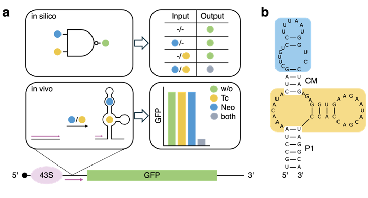
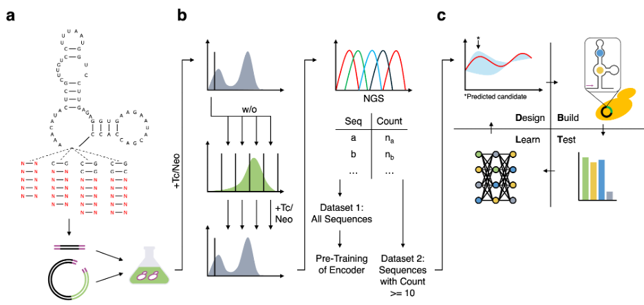
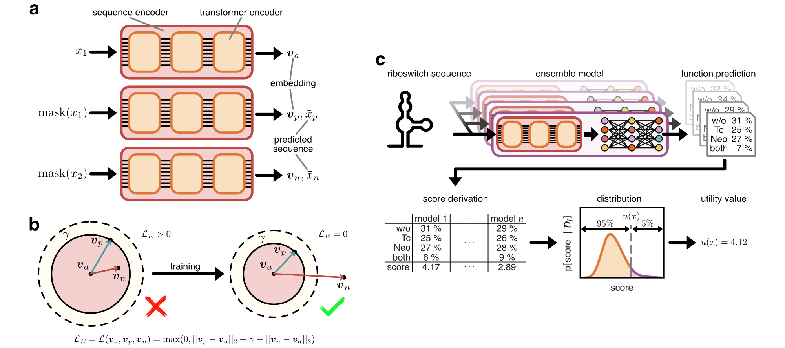
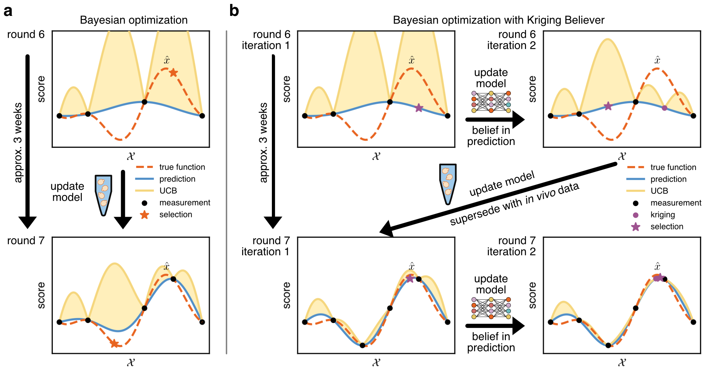
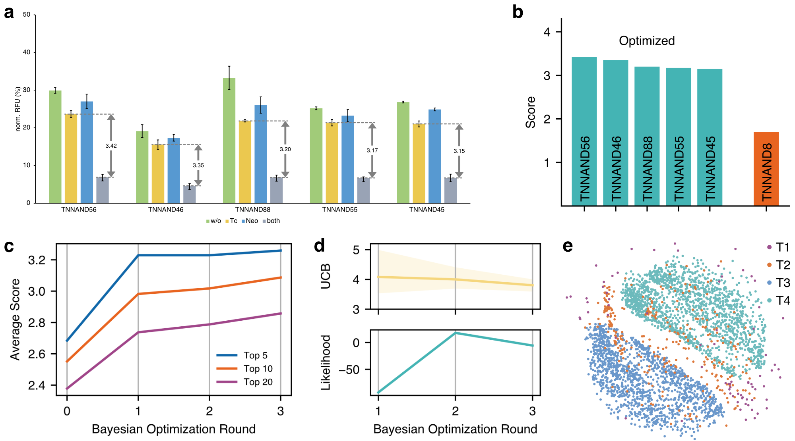

# NAND Hybrid Riboswitch Design by Deep Batch Bayesian Optimization
This repository provides the code and data corresponding to the paper [**NAND Hybrid Riboswitch Design by Deep Batch Bayesian Optimization**](https://www.biorxiv.org/content/10.1101/2025.03.28.645907v1)
 by Daniel Kelvin$, Erik Kubaczka$, Heinz Koeppl*, and Beatrix Suess*, currently available as preprint on bioRxiv.

DK, BS: Department of Biology, TU Darmstadt, Darmstadt, 64287, Germany
DK, EK, HK: Department of Electrical Engineering and Information Technology, TU Darmstadt, Darmstadt, 64283, Germany
DK, EK, HK, BS: Centre for Synthetic Biology, TU Darmstadt, Darmstadt, 64283, Germany
$ These authors contributed equally.
 
* Correspondence can be addressed to bsuess@bio.tu-darmstadt.de and heinz.koeppl@tu-darmstadt.de

## Table of Contents
1. Introduction
   - Sequence Encoder Pre-Training
   - Deep Batch Bayesian Optimization
   - Results
   - Data
6. Setup
   - Requirements
8. Citation
9. License
10. Acknowledgments

## Introduction
Hybrid riboswitches are synthetic gene regulators based solely on RNA and contain two binding pockets for different target molecules in one continuous structure.
When inserted into the 5’ UTR of an mRNA in yeast, structure stabilization induced by the binding of one or both ligands results in the hybrid riboswitch forming a physical roadblock for the scanning ribosome, thus enabling translation regulation.
Our study [**NAND Hybrid Riboswitch Design by Deep Batch Bayesian Optimization**](https://www.biorxiv.org/content/10.1101/2025.03.28.645907v1) focused on the development of a hybrid riboswitch implementing Boolean NAND behavior.
A hybrid riboswitch following NAND behavior allows translation in the absence of a ligand (w/o), as well as in the presence of only one ligand (in our case tetracycline (Tc) or neomycin (Neo)), but not in the simultaneous presence of both ligands (see Figure 1**a**).

|  |
|-----------------------------------------------------------------------------------|
| **Figure 1**                                                                      |

The hybrid riboswitch contains two modifiable areas relevant for behavior manipulation: a communication module sequence connecting the two binding pockets and a base stem P1 (Figure 1**b**).
After an initial _in vivo_ screening used to discover a communication module conferring NAND behavior, we applied the here presented sequence design framework.
In particular, previous works indicated that modifications to the P1 base stem of the construct can modulate its switching behavior.
Therefore, we applied Bayesian optimization to the design of the P1 stem of the hybrid riboswitch.
The starting point is an initial sequence pool creation where we randomize the stem of TNNAND8 (Figure 2**a**), which was the best NAND hybrid riboswitch identified in the NAND communication module screening.  

|  |
|---------------------------------------------------------------------------------|
| **Figure 2**                                                                    |

Next, we enriched functional riboswitch sequences showing dynamic range between the absence of a ligand (w/o) and the presence of both ligands (both) using cell sorting (Figure 2**b**).
We analyzed their sequences through next-generation sequencing (NGS) and used those to create two datasets.
[Dataset 1 (_data/ngs_sequences.txt)](_data/ngs_sequences.txt) contains all sequences and is used for pre-training the sequence encoder.
[Dataset 2 (_data/candidate_sequences_first_run.txt)](_data/candidate_sequences_first_run.txt) only contains the subset of sequences with a sequencing read count of at least $10$ and is used as the search space for the Bayesian optimization sequence design framework. 
In later rounds, sequences with 3 base pairs or less (including G-U pairs) where excluded from Dataset 2, yielding the updated versions [candidate_sequences_second_run.txt](_data/candidate_sequences_second_run.txt) and [candidate_sequences_third_run.txt](_data/candidate_sequences_third_run.txt).  


The software itself consists of two main parts.
The first is for the pre-training of the sequence encoder while the second is the actual deep batch Bayesian optimization for sequence design.
Both parts can be configured in the [config](config.yaml).

#### Sequence Encoder Pre-Training
The pre-training of thew sequence encoder is implemented and parameterized in [main_tokenized_ignite.py](main_tokenized_ignite.py).
As illustrated in Figure 3**a**, the pre-training employs a triplet setup of the model and trains with respect to the masked language model loss and the triplet margin loss for sequences presented in the paper.

||
|-|
|Figure 3|
For the purpose of reproducibility, [Dataset 1](_data/ngs_sequences.txt) is splitted with [dataset_splitter.py](_data/dataset_splitter.py) into a [train](_data/ngs_sequences_train.txt), [validation](_data/ngs_sequences_val.txt) and [test](_data/ngs_sequences_test.txt) set.
By executing [main_tokenized_ignite.py](main_tokenized_ignite.py), the sequence encoder is pre-trained with the default configuration reflecting the state of the publication, while alternative sequence sources can be configured in the [config](config.yaml) via the field `ngs_sequences_file`.

The parameters of the sequence-encoder pre-trained by us and used in the manuscript are stored in [`model_parameters/model_dim%3D128_max-len%3D70_triplet%3DTrue_best_model_val_loss%3D0.9688_publication_ready.pt`](model_parameters/model_dim%3D128_max-len%3D70_triplet%3DTrue_best_model_val_loss%3D0.9688_publication_ready.pt).
#### Deep Batch Bayesian Optimization
The actual sequence design is done by the batch Bayesian optimization implemented in [bayesian_optimization.py](bayesian_optimization.py) and using a deep ensemble neural network as surrogate (Figure 3**c**).
The pre-trained sequence encoder is used as initialization for the fine-tuning.

The most important input to this step is the measurement data of the previously characterized riboswitches.
These have either been characterized in previous rounds of batch Bayesian optimization or follow some initial selection.
You can specify these files with the fields `constructs_path` and `measurements_path` in the [config](config.yaml).
Files [Constructs_first_run.xlsx](_data/Constructs_first_run.xlsx) and [Dataset_Mean_first_run.xlsx](_data/Dataset_Mean_first_run.xlsx) have been used as input to our first round and can serve as example on the file format.
Besides, field `candidates_path` in [config](config.yaml) defines the text field containing Dataset 2, the candidate sequence pool.

In addition to the experimental data, one can configure the size of the ensemble (`ensemble_size`$=100$), the number of sequences per batch (`acquisition_batch_size`$=16$), and the confidence interval for the upper confidence bound (`coverage_probability`$=0.95$) in the [config](config.yaml). 
The sequences proposed by batch Bayesian optimization are stored in a new directory in [_results](_results).
In particular, an `.xlsx` file containing the already characterized sequences extended by the proposed sequences with corresponding predictions, expected score and utility values is created.
Aside, the directory contains a `.json` file providing the raw predictions of the ensemble network and the file `log_file.txt`, to which the output of Bayesian optimization is printed at runtime.

|  |
|-----------------------------------------------------------------------------------------------------------|
| Figure 4                                                                                                  |
Figure 4 contains an informal visualization of Bayesian optimization, contrasting classical Bayesian optimization (**a**) with Kriging Believer based batch Bayesian optimization (**b**), as used in this work.

### Results
Having found a communication module allowing for hybrid riboswitches featuring NAND behaviour in the first place, we continued with the P1 stem design by deep batch Bayesian optimization.
Starting with an initial dataset of $34$ characterized riboswitch sequences, three rounds of Bayesian optimization doubled the NAND functionality and yield designs featuring near digital NAND behavior.

|  |
|---------------------------------------------------------------------------------|
| Figure 5                                                                        |

Figure 5 details the results.
Figure 5**a** presents the switching behaviour of the top 5 candidates for each ligand condition.
Figure 5**b** contrasts the NAND performance in comparison to the construct featuring the original P1 stem (TNNAND8).
Figure 5**c** visualizes the average scores of top 5, top 10, and top 20 riboswitches per round
Figure 5**d** visualizing the upper confidence bound and log likelihood of the models predictions per round and 5**e** is a multidimensional scaling projection of the sequence space defined by Dataset 2.
The predictions and riboswitch sequences proposed by batch Bayesian optimization can be found in [_results](_results/).


### Data
All the data relevant for the reproduction of this works _in silico_ steps is provided in [_data](_data/).
In particular, this includes the following files listed in alphabetical order.

Candidate sequence pool, i.e. Dataset 2, for each batch Bayesian optimization round.
- [candidate_sequences_first_run.txt](_data/candidate_sequences_first_run.txt)
- [candidate_sequences_second_run.txt](_data/candidate_sequences_second_run.txt)
- [candidate_sequences_third_run.txt](_data/candidate_sequences_third_run.txt)

Files linking the construct to the sequence for each batch Bayesian optimization round. 
(Please note that round 4 was not executed but the corresponding file contains the full set of sequences for the considered constructs.)
- [Constructs_first_run.xlsx](_data/Constructs_first_run.xlsx)
- [Constructs_fourth_run.xlsx](_data/Constructs_fourth_run.xlsx)
- [Constructs_second_run.xlsx](_data/Constructs_second_run.xlsx)
- [Constructs_third_run.xlsx](_data/Constructs_third_run.xlsx)

Files providing the mean value of the measurements for each construct for each batch Bayesian optimization round.  
(Please note that round 4 was not executed but the corresponding file contains the full set of measurements for the considered constructs.)
- [Dataset_Mean_first_run.xlsx](_data/Dataset_Mean_first_run.xlsx)
- [Dataset_Mean_fourth_run.xlsx](_data/Dataset_Mean_fourth_run.xlsx)
- [Dataset_Mean_second_run.xlsx](_data/Dataset_Mean_second_run.xlsx)
- [Dataset_Mean_third_run.xlsx](_data/Dataset_Mean_third_run.xlsx)

Sequences for pre-training the sequence encoder, i.e. Dataset 1.
(The files with suffix `_test`, `_train`, and `_val` are subsets of the original file.)
- [ngs_sequences.txt](_data/ngs_sequences.txt)
- [ngs_sequences_test.txt](_data/ngs_sequences_test.txt)
- [ngs_sequences_train.txt](_data/ngs_sequences_train.txt)
- [ngs_sequences_val.txt](_data/ngs_sequences_val.txt)

The mean measurements and sequences of the constructs evaluated during the in vivo screenings preceeding the application of batch Bayesian optimization.
- [TNNAND1-10.xlsx](_data/TNNAND1-10.xlsx)

## Setup
To setup the code, please first clone this repository via:
```
git clone https://github.com/Self-Organizing-Systems-TU-Darmstadt/NANDRiboswitchDesignByBayesOpt.git
cd NANDRiboswitchDesignByBayesOpt
```
This downloads all required Python files as well as the data and the pre-trained sequence encoder parameters.


### Requirements
This software is written in Python and makes use of libraries such as numpy, torch and others. 
We tested it in a virtual environment running Python version 3.12, with the `venv` folder being located in the directory of the project.

When you are in the project directory (this is the case if you did execute `cd NANDRiboswitchDesignByBayesOpt`), you can run
```
pip install -r requirements.txt
```
to install all the dependencies required for our code. 
Be aware, that depending on your OS, you might have to use `pip3` instead of `pip`.

In particular, this installs the following packages:
```
numpy                      # Version 2.2.3 tested
scipy                      # Version 1.15.2 tested
pandas                     # Version 2.2.3 tested
openpyxl                   # Version 3.1.5 tested
matplotlib                 # Version 3.10.1 tested
pyyaml                     # Version 6.0.2 tested
torch                      # Version 2.6.0 tested
torchvision                # Version 0.21.0 tested
torchaudio                 # Version 2.6.0 tested
torchinfo                  # Version 1.8.0 tested
pytorch-ignite==0.4.12     # Version 0.4.12 tested
transformers               # Version 4.49.0 tested
optuna                     # Version 4.2.1 tested
Levenshtein                # Version 0.27.1 tested
scikit-learn               # Version 1.6.1 tested
```


## Citation
If you use this code or the data provided here, please cite the corresponding preprint.
If you like this repository, we appreciate when you give us a star. 

`
Kelvin, D.; Kubaczka, E.; Koeppl, H.; Suess, B. NAND Hybrid Riboswitch Design by Deep Batch Bayesian Optimization. bioRxiv March 28, 2025, p 2025.03.28.645907. https://doi.org/10.1101/2025.03.28.645907.
`

```
@online{kelvin2025NAND,
  title = {{{NAND Hybrid Riboswitch Design}} by {{Deep Batch Bayesian Optimization}}},
  author = {Kelvin, Daniel and Kubaczka, Erik and Koeppl, Heinz and Suess, Beatrix},
  date = {2025-03-28},
  eprinttype = {bioRxiv},
  eprintclass = {New Results},
  pages = {2025.03.28.645907},
  doi = {10.1101/2025.03.28.645907},
  url = {https://www.biorxiv.org/content/10.1101/2025.03.28.645907v1},
  urldate = {2025-04-08},
  langid = {english},    
}
```

## License
The code and the data is available under an MIT License. Please cite the corresponding preprint if you use our code and/or data.

## Funding & Acknowledgments
D.K. and B.S. were supported by the Deutsche Forschungsgemeinschaft (DFG) CRC 902(A2). 
E.K. and H.K. were supported by ERC-PoC grant PLATE (101082333). 
Views and opinions expressed are however those of the author(s) only and do not necessarily reflect those of the funding agencies.

We acknowledge the use of Python and the aforementioned Python packages.
